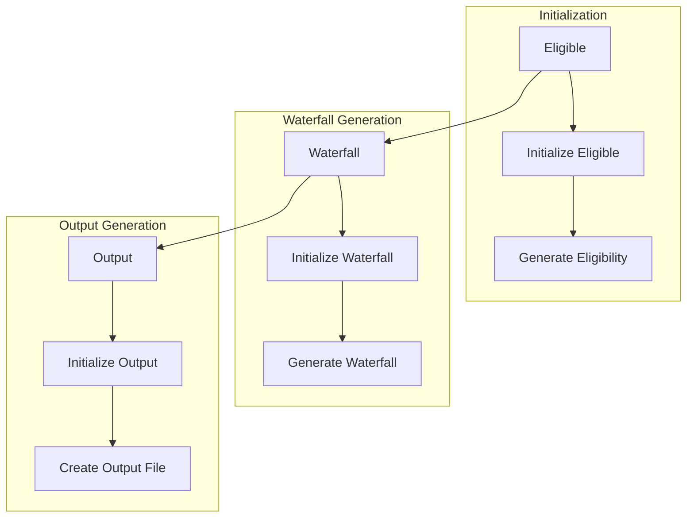

# Workflow for Using the Library

```mermaid
graph TD
    A[Eligible] --> B[Waterfall]
    B --> C[Output]

    subgraph Initialization
        A1[Initialize Eligible]
        A2[Generate Eligibility]
        A --> A1
        A1 --> A2
    end

    subgraph Waterfall Generation
        B1[Initialize Waterfall]
        B2[Generate Waterfall]
        B --> B1
        B1 --> B2
    end

    subgraph Output Generation
        C1[Initialize Output]
        C2[Create Output File]
        C --> C1
        C1 --> C2
    end
```
